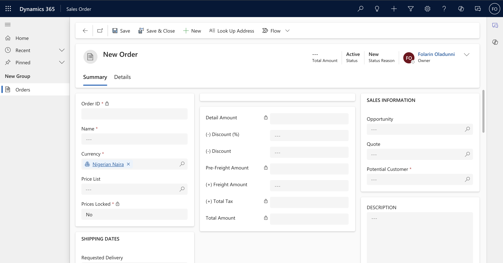
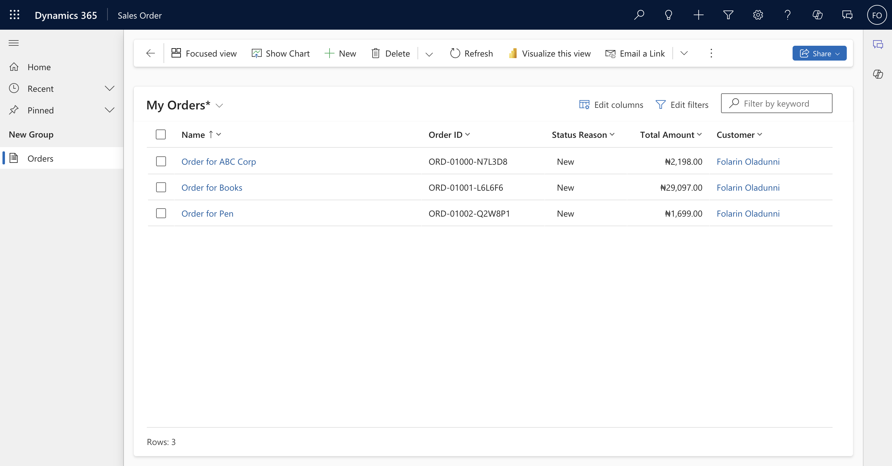
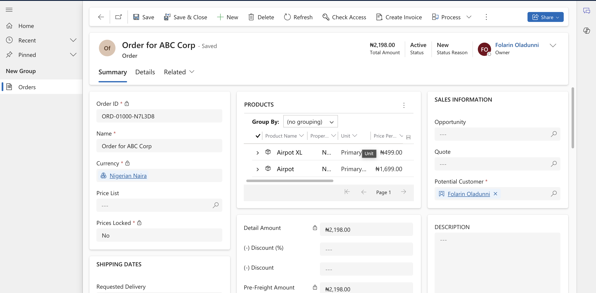

# D365-SalesOrder-VibesMeet-App
PowerApps-based app for displaying and managing D365 Sales Orders.

## Overview
This PowerApps-based application connects with Dynamics 365 to display and manage sales orders. Users can:
- View a list of all sales orders.
- Drill down into individual orders to see detailed information.
- Create a new sales order.

## Features
- **Order List:** Name, Order ID, Status Reason, Total Amount, Customer.
- **Order Details:** Provides detailed information about selected orders, including shipping address and line items.
- **D365 Integration:** Powered by the Common Data Service (CDS) for real-time data connectivity.

## Setup Instructions
1. Import the app package (`AppSource/D365SalesOrderApp.zip`) into your PowerApps environment.
2. Ensure your D365 environment has the `SalesOrder` table configured.
3. Customize the app as needed.

## Screenshots

## Demo Video

